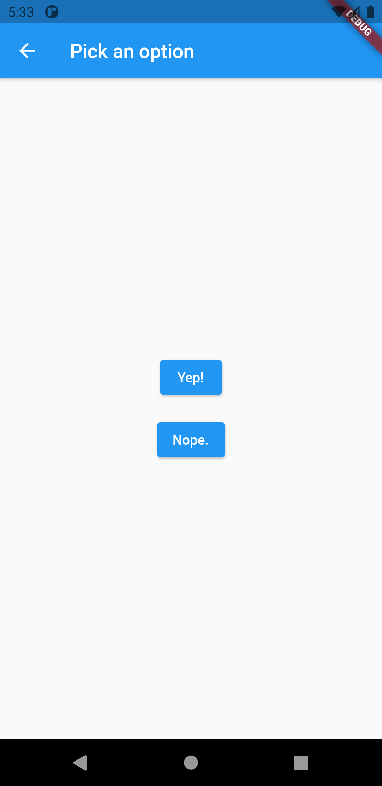

# return_data_from_screen

In some cases, you might want to return data from a new screen. For example, say you push a new screen that presents two options to a user. When the user taps an option, you want to inform the first screen of the user’s selection so that it can act on that information.

<table>
  <tr>
    <td>Screen1</td>
     <td>Screen2</td>
  </tr>
  <tr>
    <td></td>
    <td></td>
 
  </tr>
  <tr>
    <td>Screen3</td>
     <td>Screen4</td>
  </tr>
  <tr>
    <td></td>
    <td></td>
 
  </tr>
 </table>